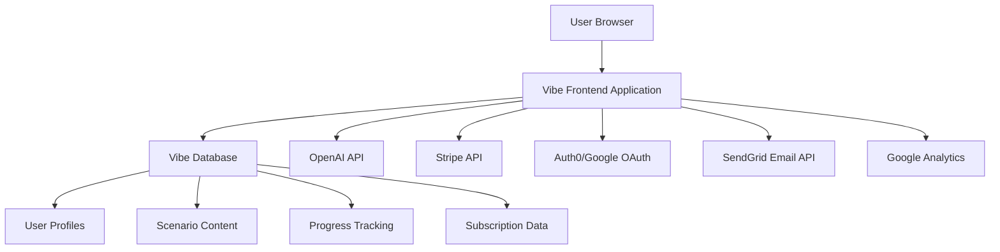

# PromptMaster Executive - Design Document

## Overview

PromptMaster Executive is designed as a sophisticated yet approachable gamified learning platform that transforms prompt engineering education for senior finance and business leaders. The design prioritizes executive-level user experience expectations while working within Vibe's no-code constraints. The platform uses familiar business contexts and progressive skill-building to create an engaging learning journey that delivers immediate, measurable value.

### Design Principles

1. **Executive-First Experience:** Clean, professional interface that matches enterprise software expectations
2. **Immediate Value Demonstration:** Users see clear business impact within the first 5 minutes
3. **Progressive Complexity:** Learning path builds from simple concepts to advanced applications
4. **Business Context Integration:** All scenarios use realistic financial and strategic business situations
5. **Minimal Cognitive Load:** Simple, intuitive navigation that doesn't require training
6. **Mobile-Responsive:** Seamless experience across desktop, tablet, and mobile devices

## Architecture

### High-Level System Architecture



### Technology Stack (Vibe-Compatible)

- **Frontend:** Vibe visual development platform with responsive components
- **Database:** Vibe's built-in database system
- **Authentication:** Google/Microsoft OAuth integration
- **AI Integration:** OpenAI GPT-4 API for prompt simulation
- **Payments:** Stripe for subscription management
- **Email:** SendGrid for automated communications
- **Analytics:** Google Analytics for user behavior tracking
- **Hosting:** Vibe's native hosting with CDN

### Data Flow Architecture

1. **User Authentication Flow:** OAuth → Profile Creation → Onboarding → Dashboard
2. **Learning Flow:** Scenario Selection → Context Presentation → Prompt Input → AI Response → Feedback → Progress Update
3. **Payment Flow:** Free Trial → Upgrade Prompt → Stripe Checkout → Feature Unlock
4. **Progress Flow:** Completion Tracking → Skill Assessment → Level Progression → Achievement Unlock

## Components and Interfaces

### Core User Interface Components

#### 1. Landing Page & Authentication
**Purpose:** Convert visitors to registered users with clear value proposition

**Key Elements:**
- Hero section with ROI calculator ("Save 10 hours/week with better AI prompts")
- Executive testimonials and logos from recognizable companies
- Clear "Start Free Trial" CTA with no credit card required
- Simple signup form (name, email, role, company size)
- Professional design matching enterprise software standards

**Vibe Implementation:**
- Responsive layout components
- Form builder with validation
- OAuth integration buttons
- Analytics tracking on key actions

#### 2. Onboarding & Demo Experience
**Purpose:** Immediate value demonstration and user activation

**Key Elements:**
- Welcome message personalized by role
- 2-minute interactive demo using budget analysis scenario
- Clear explanation of learning path and time commitment
- Immediate transition to first real scenario
- Progress indicator showing "Step 1 of 5"

**User Flow:**
1. Welcome screen with personalized greeting
2. Interactive demo: "Let's analyze this budget variance together"
3. User writes first prompt with guided hints
4. AI response demonstration with business impact explanation
5. Success celebration and transition to dashboard

#### 3. Main Dashboard
**Purpose:** Central hub for learning progress and navigation

**Key Elements:**
- Progress overview with completion percentage and current level
- "Continue Learning" CTA for next recommended scenario
- Achievement showcase with business-themed badges
- Learning streak counter and consistency metrics
- Quick access to scenario library and templates

**Layout Design:**
```
+----------------------------------+
|  Welcome back, [Name]            |
|  Your Progress: 60% Complete     |
+----------------------------------+
|  [Continue: Risk Assessment]     |
|                                  |
|  Recent Achievements:            |
|  🏆 Budget Master               |
|  📊 5-Day Streak                |
|                                  |
|  Quick Actions:                  |
|  • Scenario Library              |
|  • Template Downloads            |
|  • Team Leaderboard             |
+----------------------------------+
```

#### 4. Scenario Interface
**Purpose:** Core learning experience with business context and AI interaction

**Key Elements:**
- Business context panel with realistic documents (P&L, reports, memos)
- Clear objective statement ("Create a prompt to analyze budget variances")
- Prompt input area with character counter and formatting tools
- Real-time AI response display
- Immediate feedback system with business impact scoring
- Hint system with business-focused guidance
- Progress indicators and next steps

**Layout Design:**
```
+------------------+------------------+
|  Business Context|  Your Task       |
|  📊 Q3 P&L      |  Create a prompt |
|  📈 Variance    |  to analyze the  |
|  Report         |  budget variance |
|                 |  and recommend   |
|                 |  actions         |
+------------------+------------------+
|  Prompt Input Area                  |
|  [Text area with formatting]       |
|  💡 Hint: Be specific about format |
+------------------------------------+
|  AI Response                       |
|  [Generated response display]      |
+------------------------------------+
|  Feedback: ⭐⭐⭐⭐⭐ Excellent!    |
|  [Continue to Next Scenario]       |
+------------------------------------+
```

#### 5. Progress & Achievement System
**Purpose:** Motivation and skill validation through gamification

**Key Elements:**
- Skill level progression (Beginner → Developing → Proficient → Advanced)
- Business-themed achievement badges with clear criteria
- Learning streak tracking with milestone rewards
- Scenario completion tracking with difficulty indicators
- Peer comparison (optional, privacy-controlled)

**Achievement Categories:**
- **Skill Mastery:** "Budget Whisperer," "Risk Navigator," "Strategy Architect"
- **Consistency:** "5-Day Streak," "Monthly Champion," "Dedicated Learner"
- **Impact:** "Efficiency Expert," "Clarity Master," "Business Communicator"

#### 6. Template Library & Resources
**Purpose:** Practical application and ongoing reference

**Key Elements:**
- Categorized prompt templates by business function
- Downloadable resources (PDF guides, cheat sheets)
- Personal template saving and organization
- Usage examples with business context
- Search and filtering capabilities

**Template Categories:**
- Financial Analysis & Reporting
- Budget Planning & Variance Analysis
- Risk Assessment & Management
- Strategic Planning & Decision Making
- Board Presentations & Executive Communication

### Administrative Interfaces

#### 7. Content Management System
**Purpose:** Internal content creation and scenario management

**Key Elements:**
- Scenario creation wizard with business context templates
- Content approval workflow for quality assurance
- User progress monitoring and analytics dashboard
- Subscription management and billing oversight
- Customer support ticket system

#### 8. Analytics Dashboard
**Purpose:** Business intelligence and user behavior insights

**Key Elements:**
- User engagement metrics (session time, completion rates, retention)
- Learning effectiveness tracking (skill progression, scenario performance)
- Business impact measurement (user-reported time savings, satisfaction)
- Subscription analytics (conversion rates, churn, revenue)
- Content performance analysis (popular scenarios, difficulty ratings)

## Data Models

### User Profile Model
```javascript
User {
  id: string (primary key)
  email: string (unique)
  name: string
  role: enum ['CFO', 'VP Finance', 'Director', 'Manager', 'Analyst']
  companySize: enum ['<100', '100-1000', '1000-10000', '10000+']
  industry: string (optional)
  createdAt: timestamp
  lastLoginAt: timestamp
  subscriptionStatus: enum ['free', 'individual', 'team']
  subscriptionId: string (Stripe customer ID)
}
```

### Progress Tracking Model
```javascript
UserProgress {
  userId: string (foreign key)
  currentLevel: enum ['beginner', 'developing', 'proficient', 'advanced']
  totalPoints: integer
  scenariosCompleted: integer
  currentStreak: integer
  longestStreak: integer
  lastActivityAt: timestamp
  skillScores: {
    clarity: integer (0-100)
    specificity: integer (0-100)
    businessContext: integer (0-100)
    efficiency: integer (0-100)
  }
}
```

### Scenario Model
```javascript
Scenario {
  id: string (primary key)
  title: string
  description: text
  businessContext: text
  objective: text
  difficulty: enum ['beginner', 'intermediate', 'advanced']
  category: enum ['budget', 'risk', 'strategy', 'presentation', 'analysis']
  estimatedTime: integer (minutes)
  requiredLevel: enum ['beginner', 'developing', 'proficient', 'advanced']
  isActive: boolean
  createdAt: timestamp
}
```

### Scenario Completion Model
```javascript
ScenarioCompletion {
  id: string (primary key)
  userId: string (foreign key)
  scenarioId: string (foreign key)
  userPrompt: text
  aiResponse: text
  score: integer (0-100)
  feedback: text
  timeSpent: integer (seconds)
  hintsUsed: integer
  completedAt: timestamp
}
```

### Achievement Model
```javascript
Achievement {
  id: string (primary key)
  name: string
  description: text
  category: enum ['skill', 'consistency', 'impact']
  criteria: json
  badgeIcon: string (URL)
  isActive: boolean
}

UserAchievement {
  userId: string (foreign key)
  achievementId: string (foreign key)
  earnedAt: timestamp
}
```

## Error Handling

### User-Facing Error Management

#### 1. API Integration Errors
- **OpenAI API Failures:** Graceful fallback with pre-written example responses
- **Stripe Payment Errors:** Clear error messages with retry options and support contact
- **Authentication Issues:** Automatic retry with clear troubleshooting steps

#### 2. User Input Validation
- **Prompt Length Limits:** Real-time character counting with soft and hard limits
- **Invalid Characters:** Automatic sanitization with user notification
- **Empty Submissions:** Helpful prompts to encourage meaningful input

#### 3. Performance Issues
- **Slow API Responses:** Loading indicators with estimated wait times
- **Network Connectivity:** Offline mode indicators with retry mechanisms
- **Browser Compatibility:** Progressive enhancement with fallback options

### Technical Error Handling

#### 1. Data Integrity
- **Database Constraints:** Proper validation and error logging
- **Concurrent Updates:** Optimistic locking with conflict resolution
- **Data Migration:** Rollback procedures and data validation checks

#### 2. Third-Party Service Failures
- **Service Degradation:** Circuit breaker patterns with graceful degradation
- **Rate Limiting:** Queue management with user communication
- **Authentication Failures:** Token refresh and re-authentication flows

## Testing Strategy

### User Acceptance Testing

#### 1. Executive User Testing
- **Target Participants:** 10-15 senior finance professionals from beta network
- **Testing Scenarios:** Complete onboarding through first 3 scenarios
- **Success Metrics:** 90% completion rate, 8+ satisfaction score, clear value articulation
- **Key Questions:** "Would you recommend this to a colleague?" "How much time would this save you?"

#### 2. Usability Testing
- **Navigation Flow:** Time-to-completion for key user journeys
- **Content Clarity:** Comprehension testing for business scenarios and feedback
- **Mobile Experience:** Cross-device functionality and responsive design validation
- **Accessibility:** Screen reader compatibility and keyboard navigation

### Technical Testing

#### 1. Integration Testing
- **OpenAI API:** Response time, error handling, rate limiting
- **Stripe Integration:** Payment processing, subscription management, webhook handling
- **Authentication:** OAuth flows, session management, security validation
- **Email Delivery:** Automated communications, deliverability, unsubscribe handling

#### 2. Performance Testing
- **Load Testing:** 100 concurrent users, response time under 2 seconds
- **Stress Testing:** API rate limits, database performance, error recovery
- **Mobile Performance:** Page load times, touch responsiveness, battery usage
- **Cross-Browser Testing:** Chrome, Safari, Firefox, Edge compatibility

#### 3. Security Testing
- **Data Protection:** PII handling, encryption at rest and in transit
- **Authentication Security:** OAuth implementation, session management
- **Input Validation:** SQL injection prevention, XSS protection
- **API Security:** Rate limiting, authentication, data sanitization

### Automated Testing

#### 1. Unit Testing
- **Component Testing:** Individual UI components and business logic
- **API Integration:** Mock testing for external service interactions
- **Data Validation:** Model constraints and business rule enforcement
- **User Flow Testing:** Critical path automation for regression prevention

#### 2. Continuous Integration
- **Build Validation:** Automated testing on code commits
- **Deployment Testing:** Staging environment validation before production
- **Performance Monitoring:** Automated alerts for response time degradation
- **Error Tracking:** Real-time error monitoring and alerting

### Content Quality Assurance

#### 1. Scenario Validation
- **Business Accuracy:** Expert review of financial contexts and terminology
- **Learning Effectiveness:** Pedagogical review of skill progression and feedback
- **Difficulty Calibration:** User testing to validate scenario difficulty ratings
- **Cultural Sensitivity:** Review for inclusive language and diverse business contexts

#### 2. AI Response Quality
- **Response Relevance:** Validation that AI responses match business contexts
- **Professional Tone:** Ensuring responses meet executive communication standards
- **Accuracy Verification:** Fact-checking of business information and recommendations
- **Bias Detection:** Review for potential AI bias in business scenarios and feedback

## Implementation Considerations

### Vibe Platform Optimization

#### 1. Performance Optimization
- **Component Reusability:** Standardized UI components for consistency and performance
- **Data Caching:** Strategic caching of scenario content and user progress
- **Image Optimization:** Compressed assets for faster loading times
- **Code Splitting:** Lazy loading of non-critical components

#### 2. Scalability Planning
- **Database Design:** Efficient indexing and query optimization
- **API Rate Management:** Intelligent caching and request batching
- **User Segmentation:** Progressive feature rollout based on subscription tiers
- **Migration Readiness:** Data structure design for future platform migration

#### 3. Maintenance & Updates
- **Content Management:** Streamlined process for scenario updates and additions
- **Feature Flagging:** Ability to enable/disable features without deployment
- **Analytics Integration:** Comprehensive tracking for data-driven improvements
- **User Feedback Loop:** Systematic collection and implementation of user suggestions

### Business Continuity

#### 1. Risk Mitigation
- **Platform Dependency:** Clear migration path if Vibe limitations become blocking
- **API Dependencies:** Fallback strategies for OpenAI and Stripe service interruptions
- **Data Backup:** Regular backups with tested restoration procedures
- **Security Incidents:** Incident response plan and user communication protocols

#### 2. Growth Planning
- **User Onboarding:** Scalable processes for handling increased user volume
- **Content Scaling:** Systematic approach to scenario creation and quality assurance
- **Support Infrastructure:** Customer success processes and documentation
- **Revenue Operations:** Billing, invoicing, and subscription management at scale